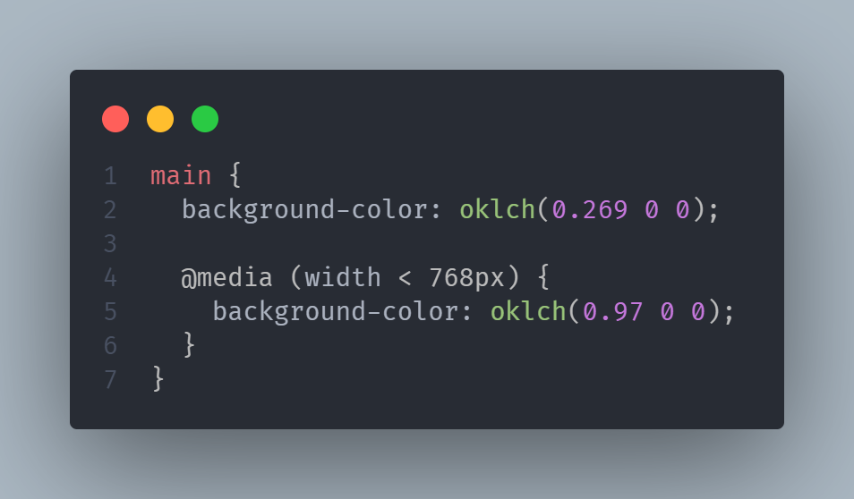
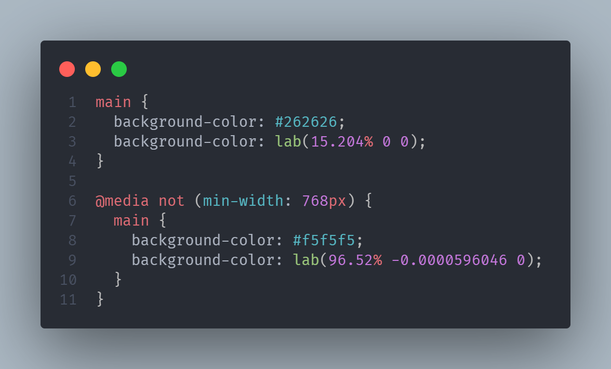

<!--
Most performance advice is a grab-bag of unrelated tips. This talk treats it as a system instead with three layers that compound: what the client has to render, how bytes travel between client and server, and how fast the server produces those bytes in the first place. Every little helps, even if you can do only some of these optimizations!

We'll go end to end with modern image formats and SSR on the rendering side, HTTP/2 vs HTTP/3 and resource hints on the transport side, and runtime choice, minification, and static asset offloading on the serving side. Along the way we'll cover practically testing these yourself on your site: is your site actually multiplexing requests? Is upgrading to Rust for latency worth what it costs you in dev velocity?

Most of this is configuration and architecture, not a rewrite. The highest impact fixes are often the ones nobody's checked in months and are cheap to verify continuously, but expensive to untangle later.
-->

# **Web Performance, End to End**

A practical tour of website performance

---

# What we'll cover

Performance isn't one trick, it's three cooperating systems:

- 🖥️ **Rendering**: what the client has to do with what it gets
- 🌐 **Transport**: how fast and how efficiently bytes move
- 🛠️ **Serving**: how quickly and cheaply the server produces those bytes

Plus: the tools to actually measure it

---

# Why bother?

- It makes a great first impression which you may otherwise lose
- The faster the site, the better the SEO
- Performance work is cheap to implement compared to the payoff
- Most of it is **configuration and architecture**, not rewriting your app

---

<!-- _class: lead -->

# 🖥️ Rendering

---

# The cost of images

- Images are usually the **heaviest** assets on a page
- Every extra KB delays paint, especially on mobile networks
- Two levers: **better formats**, and **compressing** what you already use
- This is often the single highest-leverage change on a page

---

# Use the newest image formats

<!-- https://developers.google.com/speed/webp/docs/webp_study
https://timestampcamera.net/photo-guides/webp-vs-avif-vs-jxl -->

| Format         | Compression Level                    | Support     |
| -------------- | ------------------------------------ | ----------- |
| PNG / JPEG     | Baseline                             | Widest      |
| WEBP           | Up to a quarter the size of png/jpeg | Good enough |
| AVIF / JPEG XL | Up to a quarter the size of webp     | Not great   |

- Always best to use the latest and greatest formats, but check <a href="https://caniuse.com/" target="_blank" rel="noreferrer">caniuse.com</a> to see if it's good enough
- Images can even be compressed in the same format

---

<!-- _class: lead -->

# But what if my browser doesn't support avif/jpeg XL?

---

# Serving the right format to each browser

Option 1: Client-side

```html
<picture>
  <source srcset="photo.avif" type="image/avif" />
  <source srcset="photo.webp" type="image/webp" />
  
</picture>
```

- Browser picks the first format it supports, top to bottom
- Falls back gracefully to JPEG for anything old

---

# A Better Way of Serving the right format

Option 2: Server-side

- Browsers add an accept header when requesting the image: `accept: image/avif,image/webp,...`
- If the client can accept `image/avif`, serve it!
- Works nicely with `link[rel=preload]`
- <a href="https://npmjs.com/accept-webp" target="_blank" rel="noreferrer">npmjs.com/accept-webp</a> does this, limited to only webp
  - You can also do this with some nginx rules!

---

# Server-side rendering with EJS

- We want to move as much of the rendering to the server as we can
- Browser can paint immediately with no waiting on JS to fetch data and build the DOM
- EJS: plain JavaScript templating, no new syntax to learn, fast to render

```html
<ul>
  <% for (const item of items) { %>
    <li><%= item.name %></li>
  <% } %>
</ul>
```

---

# SSR + memoization (caching)

- SSR still costs CPU time **per request** as re-rendering identical output is wasted work
- Memoize rendered fragments keyed on their inputs
- Huge win for content that's shared across users (nav, footers, articles)

---

# Rendering: recap

- Ship images in modern, compressed formats with a `<picture>` fallback
  - Or better yet, serve the right format from the server
- Render on the server so the browser has less work to do
- Memoize what you render repeatedly and don't redo work you already did

---

<!-- _class: lead -->

# 🌐 Transport

---

# HTTP/1.1's problem

- Browsers cap you at ~6 connections per origin
- Each connection handles **one request at a time**
- Headers sent uncompressed, every request
- Workarounds include making spritesheets, E.g:

  

---

# HTTP/2: current standard

- **Multiplexing**: many requests share a single TCP connection, in parallel
- **HPACK**: header compression so no more repeating headers every request
- Faster parsing thanks to binary framing instead of plaintext
- A must have nowadays for websites
- **Head-of-line blocking**: Relies on a single TCP connection, so if a packet is lost, all data streaming is stalled

---

# HTTP/3: newest standard

- Same idea, new transport: runs over **QUIC** (UDP) instead of TCP
- Fixes transport-level **head-of-line blocking**, one lost packet no longer stalls every stream
- TLS 1.3 is built in for faster handshakes (0 to 1 round trips for the handshake)
  - As opposed to 2 to 3 round trips for http1.1 or http2
- **Connection migration**: survives switching wifi → cellular without dropping the connection
- Biggest win on lossy/mobile networks

<!-- Mention needing to update firewalls for UDP connections -->

---

# HTTP/1.1 vs 2 vs 3

|                       | HTTP/1.1  | HTTP/2       | HTTP/3       |
| --------------------- | --------- | ------------ | ------------ |
| Transport             | TCP       | TCP          | QUIC (UDP)   |
| Multiplexing          | ❌        | ✅           | ✅           |
| Head-of-line blocking | Yes       | At TCP level | None         |
| Header compression    | ❌        | HPACK        | QPACK        |
| Handshake             | 2 - 3 RTT | 2 - 3 RTT    | 0 - 1 RTT    |

---

# Proving multiplexing is actually happening (1/2)

**Check: same connection**

- Chrome DevTools → Network → add the **Connection ID** column
- All requests to the same origin should show the **same ID**
- If you see multiple IDs, the browser opened separate connections and multiplexing isn't working

---

# Proving multiplexing is actually happening (2/2)

**Check: request timing**

- Look at the waterfall view
- Requests to the same origin should **start at roughly the same time**
- Under HTTP/1.1, later requests visibly queue and start staggered
- Overlapping start times = proof the connection is genuinely shared

---

# Diagnosing network issues

- [chrome://net-export/](chrome://net-export/) lets you record _all_ network events
  - Great for letting your favourite LLM make sense of it!
  - Be careful, as this can include cookies/credentials
- <a href="https://http3check.net/" target="_blank" rel="noreferrer">http3check.net</a> to check if your site supports http3 yet

---

# Resource hints

<style scoped>
table code {
  white-space: nowrap;
}
</style>

| Hint           | What it does                                                                               |
| -------------- | ------------------------------------------------------------------------------------------ |
| `dns-prefetch` | Resolve DNS early. This is the cheapest hint and more support than preconnect              |
| `preconnect`   | DNS + TCP / UDP + TLS for external resource, ahead of time (times out after 10s if unused) |
| `prefetch`     | Fetch something likely needed on the **next** navigation, low priority                     |
| `preload`      | Fetch a specific resource now, high priority and you _will_ use it in this page            |

---

# `link[rel=preload]`

```html
<link
  rel="preload"
  href="/static/fonts/notosans/NotoSans.woff2"
  as="font"
  type="font/woff2"
  crossorigin />
<link rel="preload" href="/css/critical.css" as="style" />
```

- Tells the browser about critical resources **before** the parser would normally discover them
- Best for fonts, hero images, critical CSS/JS, and anything else in the viewport on pageload

---

# Transport: recap

- Get on HTTP/2 as a baseline; understand what HTTP/3 buys you on flaky networks
- Verify multiplexing with the Connection ID column and the waterfall view
- Use `preload` sparingly, for things that truly matter to first paint

---

<!-- _class: lead -->

# 🛠️ Serving

---

# TTFB sets the floor

- Time To First Byte is the _starting line_ for everything else
- Rendering and transport optimizations can only do so much
- Every millisecond here delays parsing, painting, and every subsequent request

---

# Pick a fast runtime

- **Bun**: JavaScriptCore + Zig, fast startup, native bundler/transpiler, strong HTTP throughput
- Drop-in-ish upgrade from Node for a lot of workloads, with real latency wins

Going further:

- **Rust** or **C/C++**: extremely low overhead
- But: **diminishing returns**. The bottleneck usually shifts to your database or I/O long before the language

---

# LightningCSS

- Rust-based CSS parser, bundler, and minifier
- Target specific browser/version pairs and it'll downgrade the CSS for you

  <style scoped>
  table {
    font-family: "Roboto Mono", monospace;
  }
  </style>

  | .browserslistrc                          |
  | ---------------------------------------- |
  | Chrome 100<br/>Safari 15<br/>Firefox 100 |

---

# LightningCSS: CSS downgrading example

When targeting chrome 100:

<style scoped>
.compare {
  display: flex;
  justify-content: center;
  gap: 1em;
}
.compare figure {
  margin: 0;
  text-align: center;
}
.compare figcaption {
  font-weight: bold;
}
</style>

<div class="compare">
  <figure>
    
    <figcaption>
      <a href="./before-lightningcss.png" target="_blank" rel="noreferrer">Before</a>
    </figcaption>
  </figure>
  <figure>
    
    <figcaption>
      <a href="./after-lightningcss.png" target="_blank" rel="noreferrer">After</a>
    </figcaption>
  </figure>
</div>

---

# Minify everything

- Strip whitespace, comments, shorten identifiers
  - Keep accessibility in mind!
- Smaller payload → faster download and parse, every single request
- JS: esbuild / terser | CSS: LightningCSS
- This is close to a free win: automate it and forget about it

---

# Don't serve static files from your app server

```text
Client -> nginx -+-> static files (served directly)
                 +-> proxy_pass -> app server
```

- Your app server should be doing **application logic**, not disk I/O
- Put a reverse proxy like **nginx** in front for static assets

---

# Why nginx wins here

- Uses OS-level `sendfile()` which is highly optimized C, not your event loop
- Frees your app server's event loop/threads for the requests that actually need it
- Sits neatly in front of, or is replaced by, a CDN later

---

# Subset your fonts

- Full font files include glyphs for **every** script and language
- Most sites only ever render a fraction of that (e.g. Latin only)
- Subsetting strips unused glyphs with often a **60–90% size reduction**
  - I got my site's font down by **95%** (190KB to just 11KB)
- Tools: <a href="https://www.npmjs.com/package/glyphhanger" target="_blank" rel="noreferrer">npmjs.com/glyphhanger</a>, `pyftsubset`, or Google Fonts' `text=` parameter

---

# Serving: recap

- Faster runtime = faster TTFB, but watch for diminishing returns
- Let LightningCSS write modern CSS safely for your real target browsers
- Minify all the things!
- Static assets go through nginx, not your app server
- Subset fonts for huge savings!

---

<!-- _class: lead -->

# 📏 Measuring it

---

# Lighthouse

- Built into Chrome DevTools (also CLI / CI-friendly)
- Audits Performance, Accessibility, Best Practices, SEO
- Surfaces **Core Web Vitals**: LCP, CLS, INP
- Gives concrete, actionable "opportunities" and not just a score

---

# axe DevTools & WAVE

- Browser extensions for **accessibility** auditing
- **axe DevTools**: automated WCAG rule engine, flags exact DOM nodes with fix guidance
- **WAVE**: visual overlay directly on the page, great for a fast eyeball scan
- Performance and accessibility aren't separate concerns, both are "can people actually use this site"

---

# Make it a habit, not a one-off

- Run Lighthouse in CI, not just manually before a launch
- Treat regressions in performance/accessibility scores like you'd treat a failing test
- Cheap to check continuously, expensive to unwind months later

---

# Putting it all together

- **Rendering**: modern image formats, SSR with EJS, memoize what repeats
- **Transport**: HTTP/2 minimum, understand HTTP/3, verify multiplexing, `link[rel=preload]`
- **Serving**: fast runtime (mind diminishing returns), LightningCSS, minify, static via nginx, subset fonts
- **Measure**: Lighthouse + axe/WAVE, continuously

---

<!-- _class: lead -->

# Thanks

Questions?

<figure style="margin: 1em auto; width: fit-content; display: flex; flex-direction: column; align-items: center;">
  <svg xmlns="http://www.w3.org/2000/svg" width="306.667" height="306.667" viewBox="0 0 230 230" preserveAspectRatio="xMidYMid meet"><path d="M10 45v35h35 35V45 10H45 10v35zm60 0v25H45 20V45 20h25 25v25zm-40 0v15h15 15V45 30H45 30v15zm70-30v5h5 5v-5-5h-5-5v5zm50 30v35h35 35V45 10h-35-35v35zm60 0v25h-25-25V45 20h25 25v25zm-40 0v15h15 15V45 30h-15-15v15zm-80-5v10h5 5v10 10h-5-5v5 5h5 5v15 15h5 5v10 10h-5-5v-5-5h-5-5v20 20h5 5v5 5h-5-5v10 10h10 10v15 15h5 5v-5-5h5 5v5 5h10 10v-5-5h5 5v-5-5h-10-10v-5-5h10 10v-5-5h5 5v-10-10h5 5v10 10h5 5v-5-5h5 5v5 5h10 10v-5-5h-5-5v-5-5h-15-15v-15-15h-5-5v-10-10h5 5v5 5h5 5v5 5h5 5v5 5h-5-5v5 5h10 10v-5-5h5 5v-15-15h-10-10v-10-10h-10-10v5 5h-5-5v5 5h-5-5v-5-5h-10-10v5 5h5 5v5 5h-5-5v5 5h-5-5v5 5h5 5v-5-5h5 5v5 5h10 10v10 10h-5-5v-5-5h-10-10v5 5h5 5v5 5h5 5v5 5h-15-15v-10-10h-15-15v-5-5h10 10v-15-15h5 5v-10-10h-5-5v5 5h-5-5V95 80h5 5v5 5h5 5v-5-5h5 5v-5-5h-5-5V60 50h5 5v-5-5h-10-10v-5-5h-5-5v10 10h-5-5V40 30h-5-5v10zm30 20v10h5 5v5 5h-5-5v-5-5h-5-5v5 5h-5-5v-5-5h5 5V60 50h5 5v10zm40 65v5h-5-5v-5-5h5 5v5zm-40 50v5h-5-5v-5-5h5 5v5zM40 95v5h-5-5v5 5h5 5v10 10h-5-5v-5-5h-5-5v-5-5h-5-5v15 15h20 20v-10-10h15 15v-5-5h-5-5v-5-5h10 10v-5-5H80 70v5 5h-5-5v-5-5H50 40v5zm20 10v5h-5-5v-5-5h5 5v5zm10 30v5h5 5v-5-5h-5-5v5zm-60 50v35h35 35v-35-35H45 10v35zm60 0v25H45 20v-25-25h25 25v25zm-40 0v15h15 15v-15-15H45 30v15zm140 15v10h5 5v-5-5h5 5v5 5h15 15v-10-10h-10-10v5 5h-5-5v-5-5h-10-10v10z"/></svg>
  <figcaption style="width: fit-content;">
    <a href="https://cdrn.cc/" target="_blank" rel="noreferrer">https://cdrn.cc/</a>
  </figcaption>
</figure>
